# OASEES-stack-prototype
## Requirements
This current version of the Oasees stack requires the following:
- Docker version 24.0.5
- Docker Compose version v2.3.3
- Metamask browser extension

## Installation
```sh
cd oasses-stack-prototype
nano .env (change every ip to your host's ip)
nano .devices_env (change ip to your host's ip)
./install_stack.sh
```
The initial building procedure can take a while depending your hardware
## Check Installation
After the building procedure finishes, the following containers must be up and running:
- ipfs
- oasees_portal
- flask_notebooks_api
- hardhat
You can check by typing:
```sh
docker ps -a --format "{{.Names}}"
```
If everything is up and running, open your browser and type:

**http://{YOUR_HOST_IP}:3000**

Choose an account from hardhat_accounts.txt

**NOTE** : For the demo devices 4 accounts have been chosen:

 - Account#14
 - Account#16
 - Account#17
 - Account#18

Also Do **NOT** use this account since it is used by backend functionalities
for deploying contracts , etc:
- Account #0: 0xf39fd6e51aad88f6f4ce6ab8827279cfffb92266
- Private Key: 0xac0974bec39a17e36ba4a6b4d238ff944bacb478cbed5efcae784d7bf4f2ff80

**Make sure that you use a different account to login to the portal!!**


## Sample Usage
The following sections refers to a sample usage of the stack. Dedicated scripts were developed in order to automate and test the functionalities of the stack: 
```bash
├── oasees-stack-prototype
│   ├── requirements.txt
│   ├── deploy_dao
│   │   ├── create_daos.py
│   ├── populate_algorithms
│   │   ├── populate.py
│   │   ├── samples
│   ├── populate_devices
│   │   ├── populate.py
└──
```
Before using the scripts, some python modules are required to be installed locally or in a virtual env.
**The requirements.txt file is located to the root folder of the project**
```sh
pip3 install -r requirements.txt
```
### Deploy Sample DAOs
```sh
cd deploy_dao
```
The sample DAO is a set of pre-compiled smart-contracts located at **dao_compiled_contracts** folder.
```bash
├── deploy_dao
│   ├── dao_compiled_contracts
│   │   ├── Box.json
│   │   ├── Governance.json
│   │   ├── TimeLock.json
│   │   ├── VoteToken.json
│   │   ├── VoteTokenProvider.json
│   ├── deploy_dao_template.py
│   ├── create_daos.py
└──
```
In **create_daos.py** script we can change some parameters of the sample dao as depicrted bellow or we can add another DAO to be created:
```python
Daos_to_create  = [
	{
		"DAO_NAME": "DRONES DAO",
		"DAO_DESC": "A dao for drones",
		"MIN_DELAY": 0,
		"QUORUM_PERCENTAGE": 50,
		"VOTING_PERIOD": 10,
		"VOTING_DELAY": 0,
	}
]
```
To deploy a DAO or a set of DAOs run the following
```sh
cd deploy_dao
python3 create_daos.py
```
### Populate MarketPlace with sample Algorithms 
The following script will populate the Marketplace with some sample Algorithms in the form of python scripts.

```sh
cd populate_algorithms
python3 populate.py
```

### Create sample Devices with local docker containers 
In order to have a ***proof of concept integration*** of the oasees stack prototype and the devices , a set of scripts and configuration files are created to "emulate the devices" in our ***local docker enviroment***.  The created containers will run the actual image of the **oasees_agent**.  The repository has a working example if the user does not need to apply any changes.
```sh
cd demo_devices
```

First let's take a look at the **docker-compose.yaml** file:
```sh
version: '3'
services:
  device1:
    build:
      context: ./agent_template
    ports:
      - "8001:5000"  
    stop_grace_period: 1s

  device2:
    build:
      context: ./agent_template
    ports:
      - "8002:5000"
    stop_grace_period: 1s 

...
```
This is a part of the docker-compose file which deploys containers that run the oasees agent and exposes the endpoint using the host ip at the specified port.(8001 and 8002 etc).
(In case you need to change the provided example feel free to do so)
To run the containers run the following:

```sh
docker compose up --build -d
```
Now the container devices are up and running. Check by running:
```sh
curl http://{YOUR_HOST_IP}:8001/status #if you haven't changed the port 
```
A sample output would be:
```sh
{"msg":{"BLOCKCHAIN_IP":"","IPFS_HOST":"","status":"NOT Configured"}}
```

Now the devices must be configured. For the automation purposes , a **.devices_env** configuration file is created. A part of this file is shown bellow:
```sh
BLOCK_CHAIN_IP = {YOUR_HOST_IP}
IPFS_HOST = {YOUR_HOST_IP}

device1_addr = 0x2546BcD3c84621e976D8185a91A922aE77ECEc30
device1_key = 0xea6c44ac03bff858b476bba40716402b03e41b8e97e276d1baec7c37d42484a0
device1_name = "Drone1"
device1_endpoint = "http://{YOUR_HOST_IP}:8001"

device2_addr = 0xbDA5747bFD65F08deb54cb465eB87D40e51B197E
device2_key = 0x689af8efa8c651a91ad287602527f3af2fe9f6501a7ac4b061667b5a93e037fd
device2_name = "Drone2"
device2_endpoint = "http://{YOUR_HOST_IP}:8002"
...
```
You'll need to replace the {YOUR_HOST_IP} with your host's ip. **Note** the ports must be the same as defined to the **docker-compose.yaml** file.

The last file we need to take a look is the **configure_devices.py**:
```
devices  = [
	{
	"device_endpoint":os.getenv("device1_endpoint"),
	"config_data":{
	"account": os.getenv("device1_addr"),
	"secret_key": os.getenv("device1_key"),
	"device_name": os.getenv("device1_name"),
	"IPFS_HOST": IPFS_HOST,
	"BLOCK_CHAIN_IP": BLOCK_CHAIN_IP
	}
},
...
```
The devices array must contain all the needed information for each device as given from the **.devices_env** file.
Run the following script to configure the oasees agent containers:
```sh
python3 configure_devices.py
```
After configuring the devices you can check the by executing:
```sh
curl http://{YOUR_HOST_IP}:8001/status #if you haven't changed the port 
```
A sample output would be:
```sh
{"msg":{"BLOCKCHAIN_IP":"10.150.0.151","IPFS_HOST":"10.150.0.151","status":"Configured"}}
```
### Populate the Marketplace with the configured devices
The devices need to be published to the Oasees Marketplace and this is achieved by the automation script **populate_devices/populate.py**:
```sh
DEVICES = [
    {'device_name':os.getenv("device1_name"),"account":os.getenv("device1_addr"),"endpoint":os.getenv("device1_endpoint")},
    {'device_name':os.getenv("device2_name"),"account":os.getenv("device2_addr"),"endpoint":os.getenv("device2_endpoint")},
...
]
```
By running the following, the devices are published to the oasees marketplace:
```sh
python3 populate.py
```

## Metamask Configuration
Click to Metamask Browser Extention and follow the steps as depicted bellow:
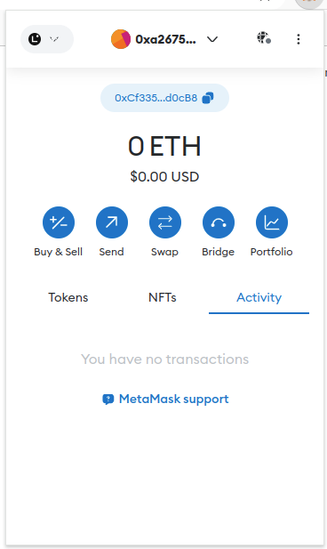
<br/>
The network options will open the following.Click the marked options in red:
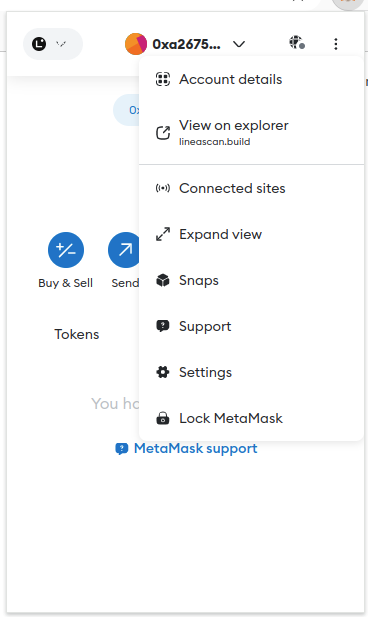
<br/>
Configure the local oasees-net:
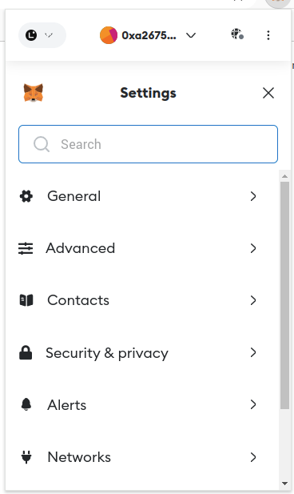
<br/>
After the successfull network configuration, click the marked button:
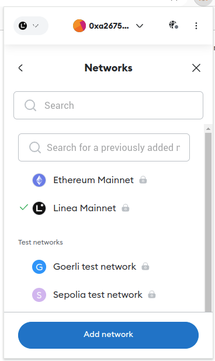
<br/>
Follow the step bellow to import an account by providing a private key from **hardhat_accounts.txt**.
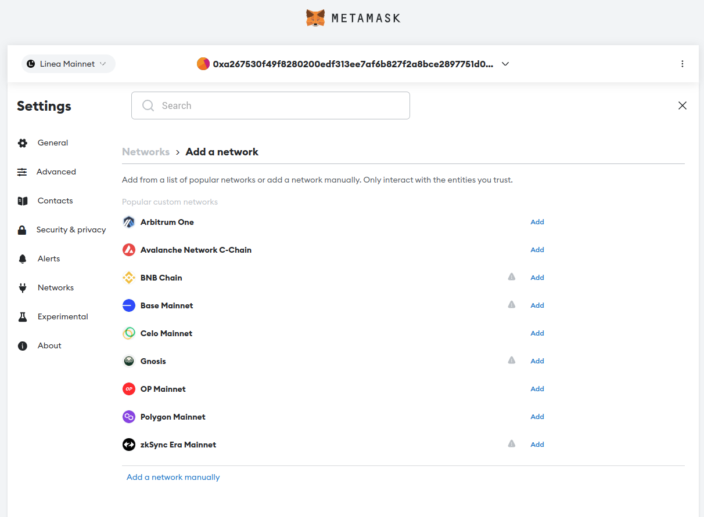
<br/>
Finally make sure that you use the imported account when you click the Oasees portal Connect button as shown to the Basic Usage Screenshots.
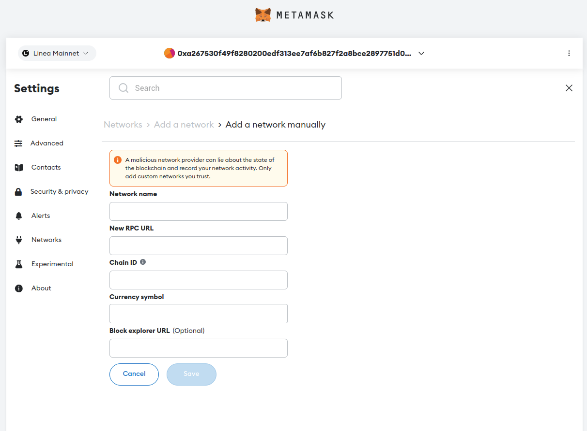
<br/>


## Basic Usage Screenshots
As soon as the oasees stack is up and running, you can access the login page.
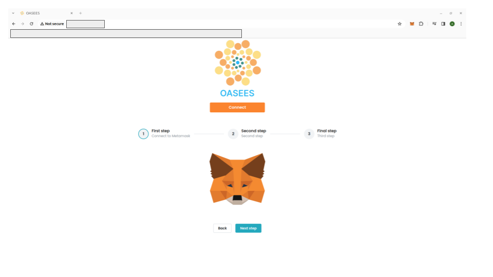
<br/>
Overview of the homepage.
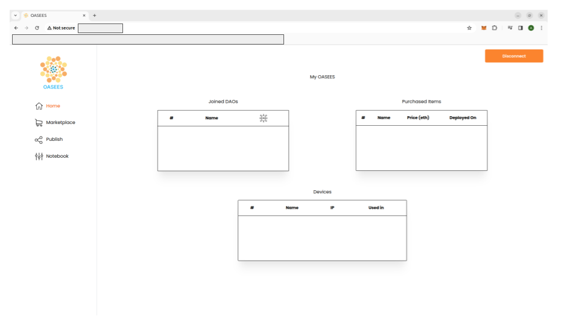
<br/>
Using the marketplace tab the user can nagivate to all available Algorithms , DAOs and Devices.
<br/>
Buy some algorithms by pressing the Buy button
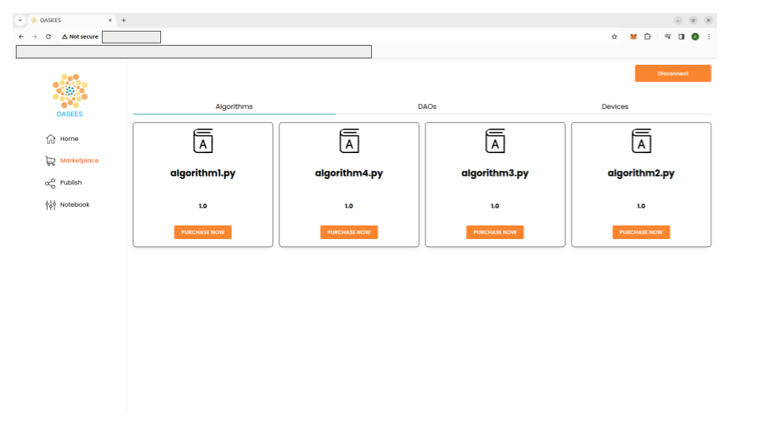
<br/>
Press the Join Button to join a DAO
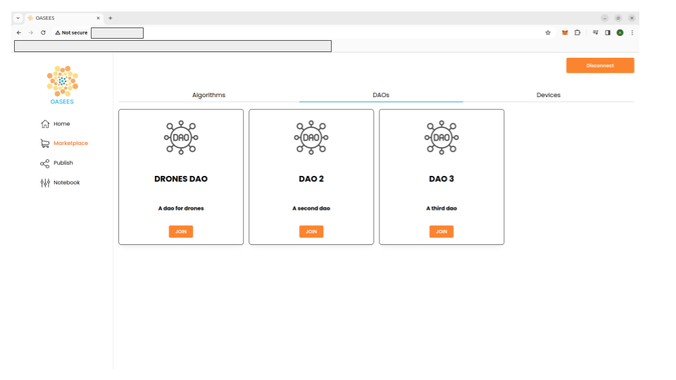
<br/>
Get the available devices by pressing the Buy button
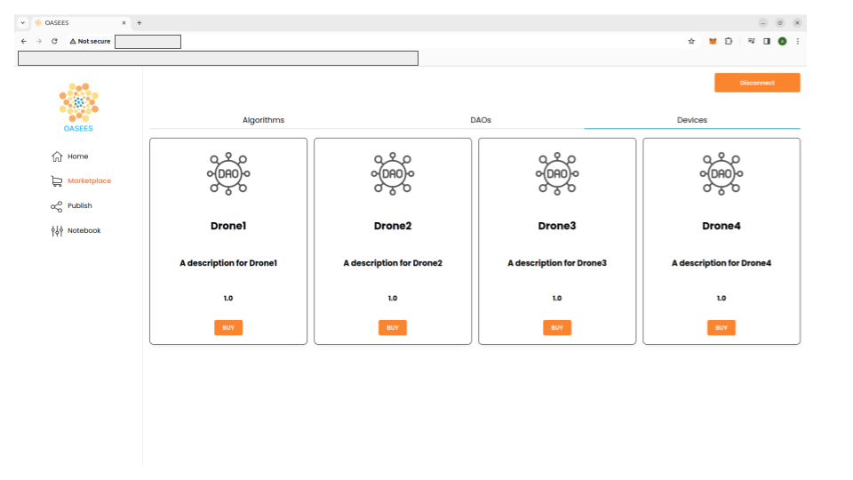
<br/>
The homepage contains the Joined Daos ,the devices and the purchaced algorithms.
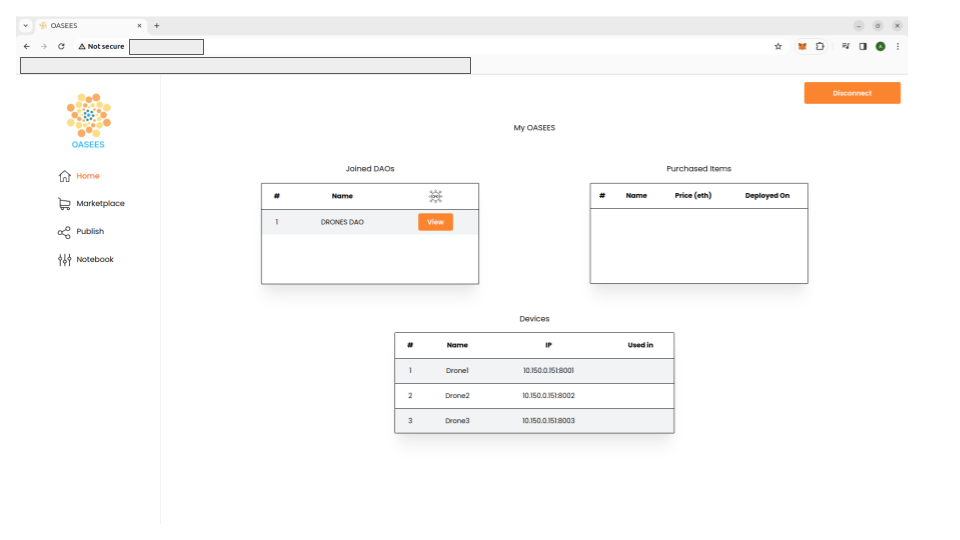
<br/>
To register the devices as DAO members press the View button. This will open a modal with two tabs: Overview and Manage.
<br/>
Click on Manage Tab and register the devices by pressing the join button
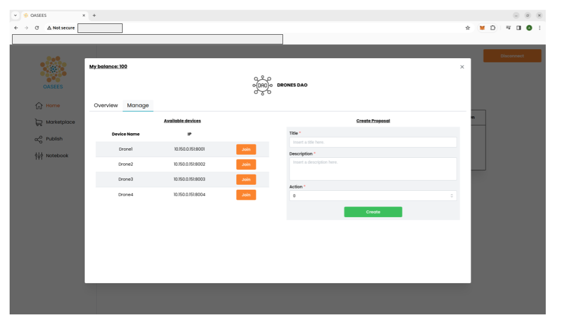
<br/>
Now at the Overview Tab of the DAO the Devices will be displayed as participants
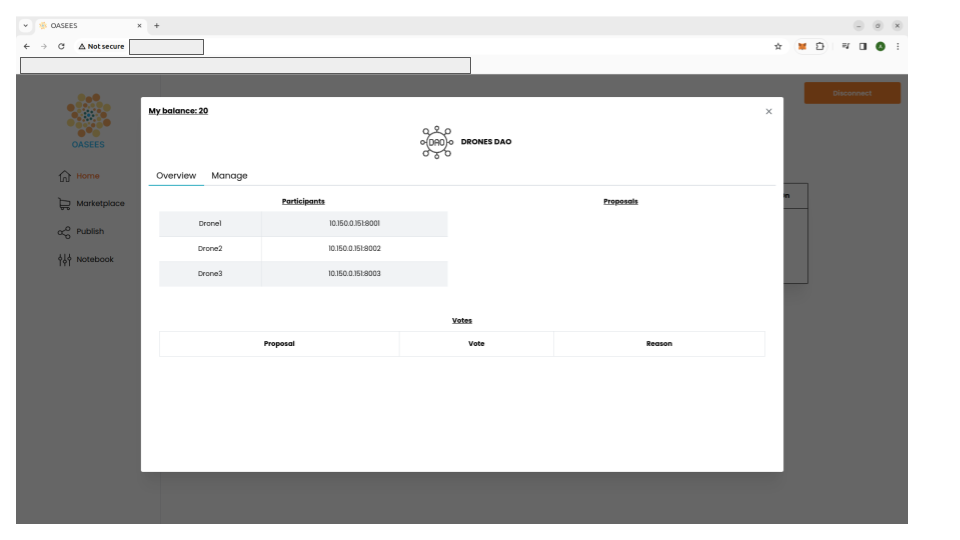
<br/>

### Validate that the devices are actually Dao members
```sh
curl http://{YOUR_HOST_IP}:8001/check_dao #if you haven't changed the port 
```
A sample output would be:
```sh
{"msg":"device is member of DRONES DAO"}
```

## More detailed instructions and demos will follow
